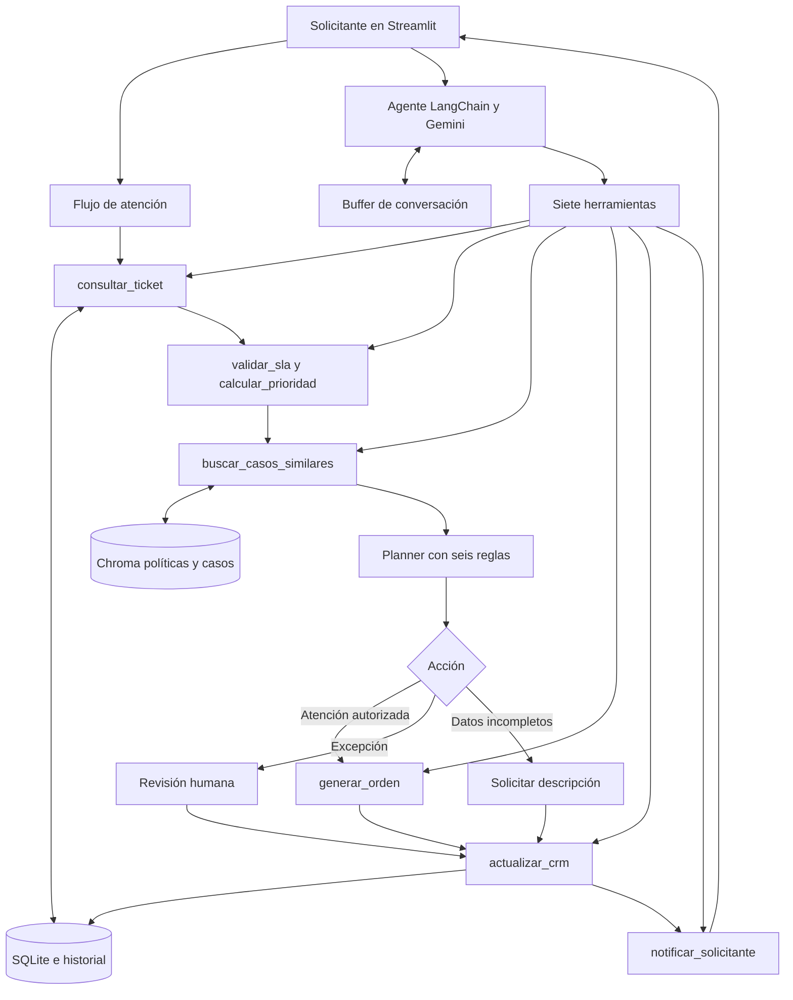

# Orquestación de ServiceDesk Andina

```mermaid
flowchart TD
    U[Solicitante en Streamlit] --> F[Flujo de atención]
    U --> A[Agente LangChain y Gemini]
    A <--> B[Buffer de conversación]
    A --> T[Siete herramientas]
    F --> C[consultar_ticket]
    C <--> SQL[(SQLite e historial)]
    C --> V[validar_sla y calcular_prioridad]
    V --> R[buscar_casos_similares]
    R <--> CH[(Chroma políticas y casos)]
    R --> P[Planner con seis reglas]
    P --> D{Acción}
    D -->|Atención autorizada| O[generar_orden]
    D -->|Excepción| H[Revisión humana]
    D -->|Datos incompletos| I[Solicitar descripción]
    O & H & I --> CRM[actualizar_crm]
    CRM --> SQL
    CRM --> N[notificar_solicitante]
    N --> U
    T --> C & V & R & O & CRM & N
```
